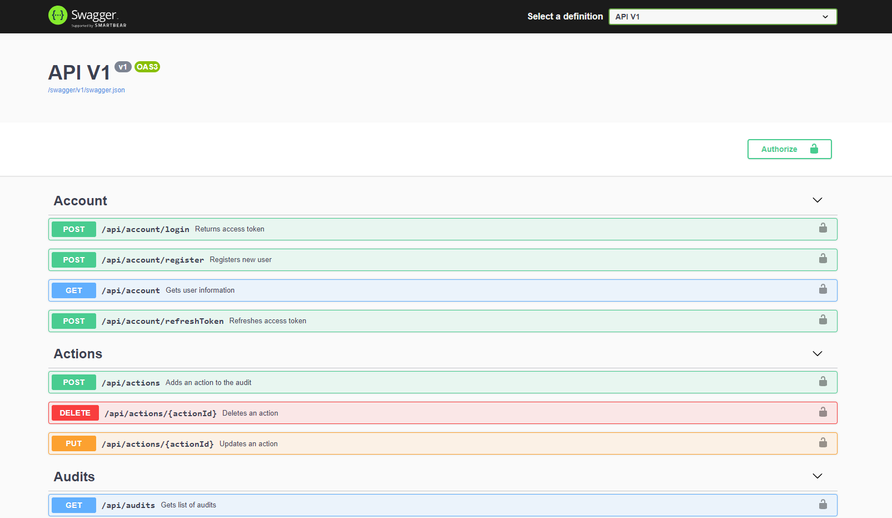
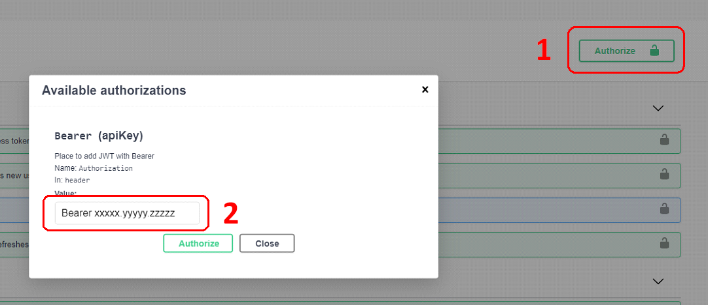
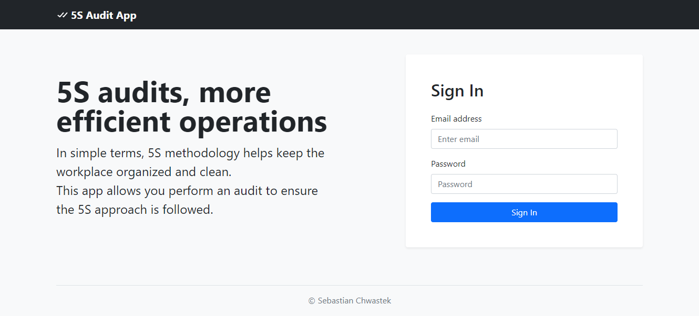
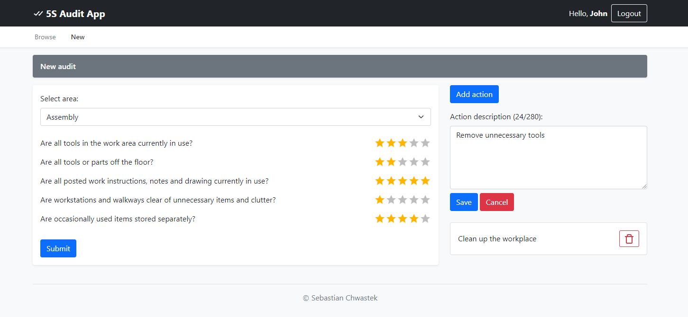
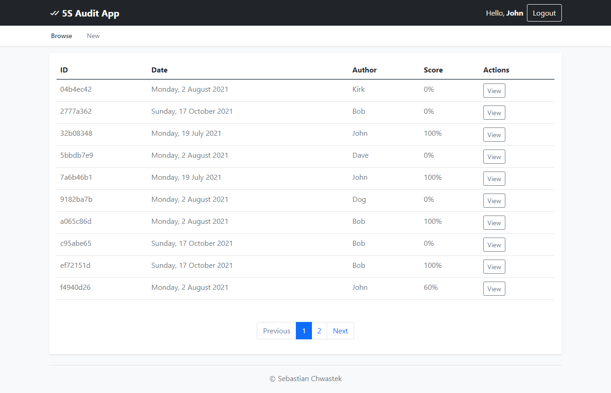
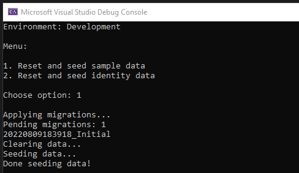

# 5S Audit App

## Overview

5S audits promote more efficient operations. In simple terms, 5S methodology helps keep the workplace organized and clean. 
This app allows you perform an audit to ensure the 5S approach is followed.

This application is still in development. See [Roadmap](#roadmpap).

### Features

* Create and browse audits
* API: JWT authentication with refresh tokens
* API: Paging, sorting
* API: Security headers

### Built with

* [React.js](https://reactjs.org/) - frontend (client)
* [Angular](https://angular.dev/) - frontend (another client)
* [.NET](https://dotnet.microsoft.com/en-us/download) - backend (API)

## Getting started

### Prerequisites

Make sure you have installed the following prerequisites:

* [VS Code](https://code.visualstudio.com/) _(optional but preferred)_

* [SQLiteStudio](https://sqlitestudio.pl/) _(or other software to browse SQLite database)_

* [Git](https://git-scm.com/downloads)

```sh
git --version
# => git version 2.34.0.windows.1
```

* [Node.js](https://nodejs.org/en/download/)

```sh
node --version
# => v20.11.1

npm --version
# => 10.2.4
```

* [.NET SDK](https://dotnet.microsoft.com/en-us/download/dotnet)

```sh
dotnet --version
# => 8.0.111
```

* [EF Core CLI tools](https://docs.microsoft.com/en-us/ef/core/cli/dotnet)

```sh
dotnet ef --version
# => 9.0.0
```

### Installation

1. Clone the repository
```sh
git clone https://github.com/schwastek/5s-audit-app.git
```
2. Install npm packages of React
```sh
cd client
npm clean-install
```
3. Or install npm packages of Angular
```sh
cd client-angular
npm clean-install
```
4. Generate SSL certificate for Angular local development
```sh
cd client-angular/ssl
dotnet dev-certs https --export-path ./certificate.pem --no-password --trust --format PEM
```

### Running application

When you start ASP.NET Core web API, it won't launch React or Angular client app automatically.  
**Both frontend and backend must be started manually.**

Run React frontend app:

```sh
cd client
npm start
```

Or run Angular frontend app:

```sh
cd client-angular
npm start
```

Run ASP.NET Core web API:

```sh
cd Api
dotnet run
```

In a web browser, navigate to http://localhost:3000 (React) or https://localhost:4200 (Angular).

Log in with email and password:

* **`john@test.com`**
* **`Pa$$w0rd`**

### Swagger

**Swagger UI** is available at https://localhost:5000/swagger/index.html after [running the application](./README.md#running-application).



To execute protected endpoints you need to authenticate yourself first.

Execute `/api/account/login` endpoint to obtain the access token.

Then click **Authorize** button and paste the access token in the following format: `Bearer xxxxxxxx.yyyyy.zzzzz`.



## Usage

Log in



Create new audit



Browse audits



## Documentation

### API

| API | Description |
|---|---|
| `GET /api/audits`  | Get a list of audits (paged by default) |
| `GET /api/audits?orderBy=author asc&pageSize=5&pageNumber=1`  | Get a list of audits (paged and sorted) |
| `GET /api/audits/{{id}}` | Get an audit by ID |
| `POST /api/audits` | Create an audit |
| `POST /api/actions` | Add an action to audit |
| `PUT /api/actions/{{id}}` | Update an action |
| `DELETE /api/actions/{{id}}` | Delete an action |
| `GET /api/questions` | Get a list of questions |
| `POST /api/account/login` | Log a user in |
| `POST /api/account/refreshToken` | Refresh token for a logged in user |
| `GET /api/account` | Get the current logged in user |
| `POST /api/account/register` | Register a new user  |

### Database

SQLite database file is created in the special "local" folder for your platform.  
Use Run command below (`WIN+R`) to open the "local" folder on Windows: `C:\Users\{Username}\AppData\Local`.

```
%LocalAppData%
```

You can run `Api.Data` console application to seed database:



### Common commands

To manage migrations you can use [dotnet ef CLI tools](https://learn.microsoft.com/en-us/ef/core/cli/dotnet)
or [Package Manager Console](https://learn.microsoft.com/en-us/ef/core/cli/powershell).

```sh
# Add migration
dotnet ef migrations add MyMigration --project Api.Data --startup-project Api.Data

# Remove last migration
dotnet ef migrations remove --project Api.Data --startup-project Api.Data

# Apply migrations (specify environment)
dotnet ef database update --project Api.Data --startup-project Api.Data -- --environment Development

# Or apply migrations using Package Manager Console
Update-Database -Project Api.Data -StartupProject Api.Data -Args '--environment Development'
```

## Roadmap

- [x] Create audits
- [x] Browse audits
- [x] Login
- [x] Audit actions
- [ ] Registration
- [ ] Action comments
- [ ] Image upload

## License

Distributed under the MIT License. See [`LICENSE.txt`](./LICENSE.txt) for more information.

## Acknowledgments

Resources I find helpful and would like to give credit to:

* Dockx, K. (2019). _Building a RESTful API with ASP.NET Core 3_. Pluralsight. - [Course](https://www.pluralsight.com/courses/asp-dot-net-core-3-restful-api-building) • [GitHub](https://github.com/KevinDockx/BuildingRESTfulAPIAspNetCore3)
* Dockx, K. (2020). _Implementing Advanced RESTful Concerns with ASP.NET Core 3_. Pluralsight. - [Course](https://www.pluralsight.com/courses/asp-dot-net-core-3-advanced-restful-concerns) • [GitHub](https://github.com/KevinDockx/ImplementingAdvancedRESTfulConcernsAspNetCore3)
* Resca, S. (2019). _Hands-On RESTful Web Services with ASP.NET Core 3_. Packt Publishing. - [Book](https://www.packtpub.com/product/hands-on-restful-web-services-with-asp-net-core-3/9781789537611) • [GitHub](https://github.com/PacktPublishing/Hands-On-RESTful-Web-Services-with-ASP.NET-Core-3)
* Rippon, C. (2019). _ASP.NET Core 3 and React_. Packt Publishing. - [Book](https://www.packtpub.com/product/asp-net-core-3-and-react/9781789950229) • [GitHub](https://github.com/PacktPublishing/ASP.NET-Core-3-and-React)
* Cummings, N. (2019). _Complete guide to building an app with .Net Core and React_. Udemy. - [Course](https://www.udemy.com/course/complete-guide-to-building-an-app-with-net-core-and-react/) • [GitHub](https://github.com/TryCatchLearn/Reactivities)
* Code Maze (2023). _Ultimate ASP.NET Core Web API_. - [Book](https://code-maze.com/ultimate-aspnetcore-webapi-second-edition/)
