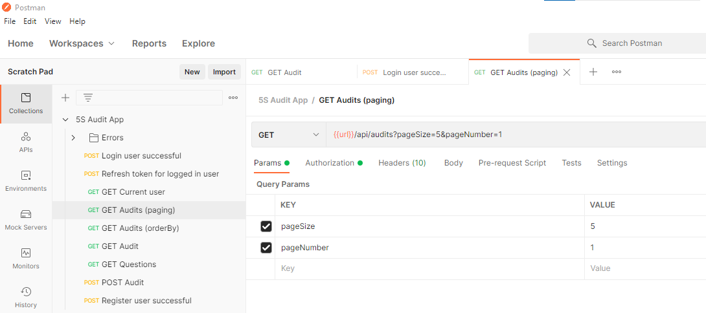

# API

## Endpoints

| API | Description |
|---|---|
| `GET /api/audits`  | Get a list of audits (paged by default) |
| `GET /api/audits?orderBy=author asc&pageSize=5&pageNumber=1`  | Get a list of audits (paged and sorted) |
| `GET /api/audits/{{id}}` | Get an audit by ID |
| `POST /api/audits` | Create an audit |
| `POST /api/actions` | Add an action to audit |
| `PUT /api/actions/{{id}}` | Update an action |
| `DELETE /api/actions/{{id}}` | Delete an action |
| `GET /api/questions` | Get a list of questions |
| `POST /api/account/login` | Log a user in |
| `POST /api/account/refreshToken` | Refresh token for a logged in user |
| `GET /api/account` | Get the current logged in user |
| `POST /api/account/register` | Register a new user  |

## Postman

### Sending requests

For testing API, you can use [Postman](https://www.postman.com/downloads/) and import [`5S Audit App.postman_collection.json`](./postman/5S%20Audit%20App.postman_collection.json).

### Authentication

Use **Login user successful** request to authenticate yourself before using protected API resources (e.g. creating audits).

Some API requests require token in the `Authorization` header. Token is set automatically by Postman (using environment variables) when you send request named **Login user successful**.
